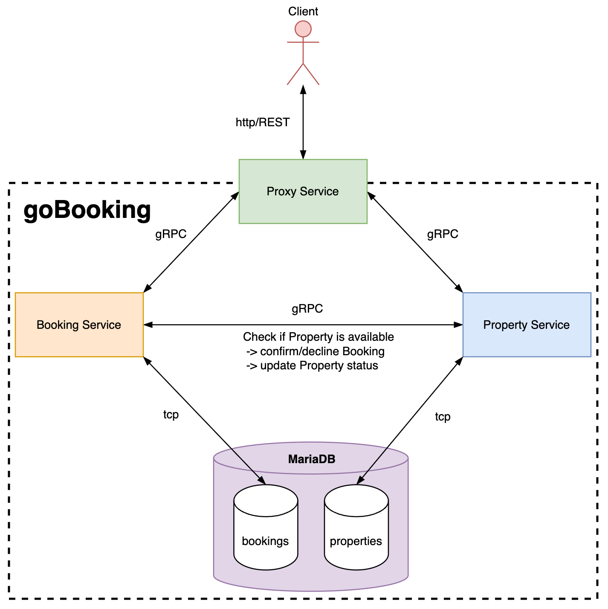

# PSE BEE - goBooking
By Hannes Kececi

A simple Go implementation of a booking service offering an HTTP API to consumers 
and internally communicating via gRPC.



The easiest way to start the application is using Docker Compose:
```
docker compose up
```

To cleanup, run:
```
docker compose down
```

The file [goBooking_API.yaml](goBooking_API.yaml) contains the API specification
that can be used to test the application e.g. via Postman. 

## Local development

You will need to have Go >=1.20 installed, if you want to develop the application locally.
Remember to start it with `docker compose up --build` to make sure your latest changes are processed.


## Tests

The application contains some basic tests for the Booking and Property microservices.

Start the Booking tests with:
```
go test booking
```

**NOTE:** To run the Booking tests, you have to specify the following env variable:
```
PROPERTY_CONNECT=:9111
```
This is required because the tests for `createBooking` and `deleteBooking` start up
a `MockPropertyInternalServer` and connect to it on port `9111`.

Start the Property tests with:
```
go test property
```

Each test starts up a test database and destroys it on completion. 
The database is not reused between tests because its state should not 
affect the test execution.